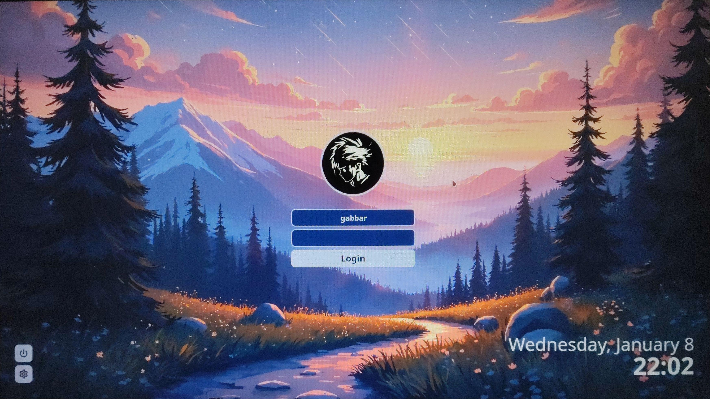

# Gloomy SDDM Theme

<div align="center">

</div>

The Gloomy theme is a custom theme for SDDM (Simple Desktop Display Manager) designed to provide a sleek, dark, and modern login screen for your system. This theme enhances the login experience with its minimalist design and visually appealing aesthetics.

## Installation

### Automated Installation (Recommended)

1. Download and open the folder in terminal.
2. Use the provided installation script to install the theme:

   ```bash
   ./install.sh
   ```

   The script will:

   - Move the `gloomy` theme folder to `/usr/share/sddm/themes/`.
   - Update or create the SDDM configuration file (`/etc/sddm.conf`) to set `Current=gloomy`.
   - Restart the SDDM service to apply the changes.

3. Follow the prompts in the script to complete the installation.

### Manual Installation

1. Copy the `gloomy` theme folder to `/usr/share/sddm/themes/`:

   ```bash
   sudo cp -r gloomy /usr/share/sddm/themes/
   ```

2. Edit the SDDM configuration file (`/etc/sddm.conf`) to set the current theme:

   - Open the file in a text editor:
     ```bash
     sudo nano /etc/sddm.conf
     ```
   - Add or update the following section:
     ```
     [Theme]
     Current=gloomy
     ```

3. Restart the SDDM service to apply the changes:
   ```bash
   sudo systemctl restart sddm.service
   ```

## Uninstallation

To remove the Gloomy theme:

1. Delete the theme folder:

   ```bash
   sudo rm -r /usr/share/sddm/themes/gloomy
   ```

2. Edit the `/etc/sddm.conf` file and update the `[Theme]` section to use a different theme.

3. Restart the SDDM service:
   ```bash
   sudo systemctl restart sddm.service
   ```

## Troubleshooting

- If the login screen does not display correctly after installation, ensure that:

  - The `gloomy` folder is correctly placed in `/usr/share/sddm/themes/`.
  - The `/etc/sddm.conf` file is properly configured with `[Theme] Current=gloomy`.

- To debug, check the SDDM logs:
  ```bash
  sudo journalctl -u sddm
  ```

## License

This project is licensed under the [MIT License](LICENSE).

---

Enjoy your sleek and modern **Gloomy-SDDM** theme!

<div align="center">
    <a href="https://github.com/sponsors/Gabbar-v7"></a>&nbsp;
    <a href="https://buymeacoffee.com/gabbar_v7"></a>&nbsp;
    <a href="https://www.paypal.me/GabbarShall"></a>
</div>
